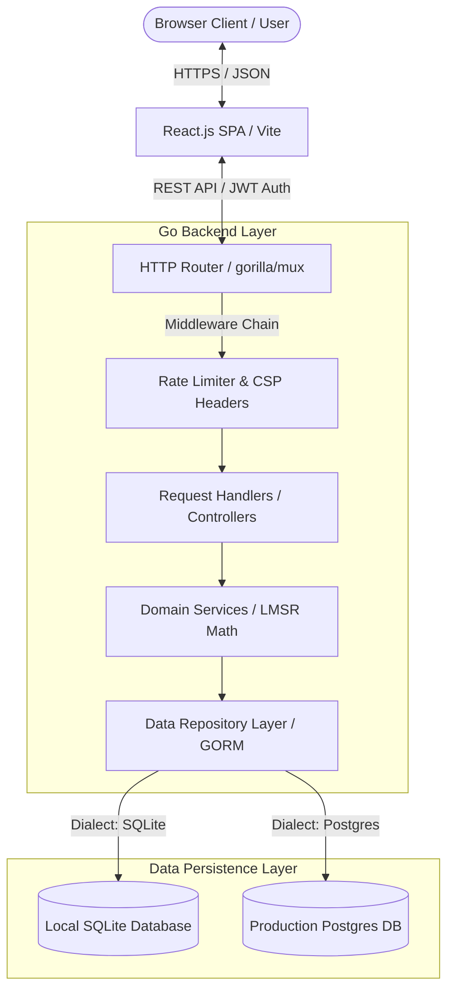
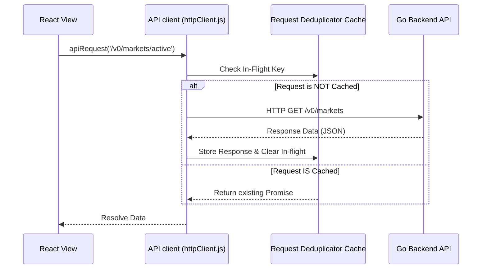
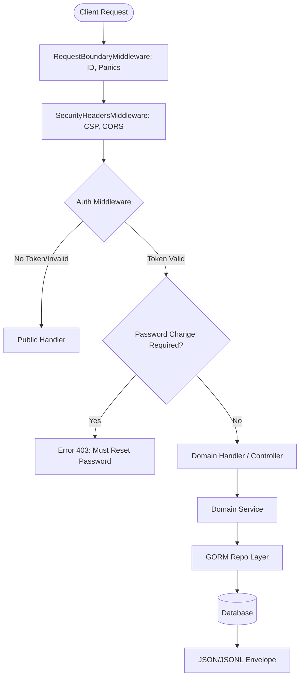
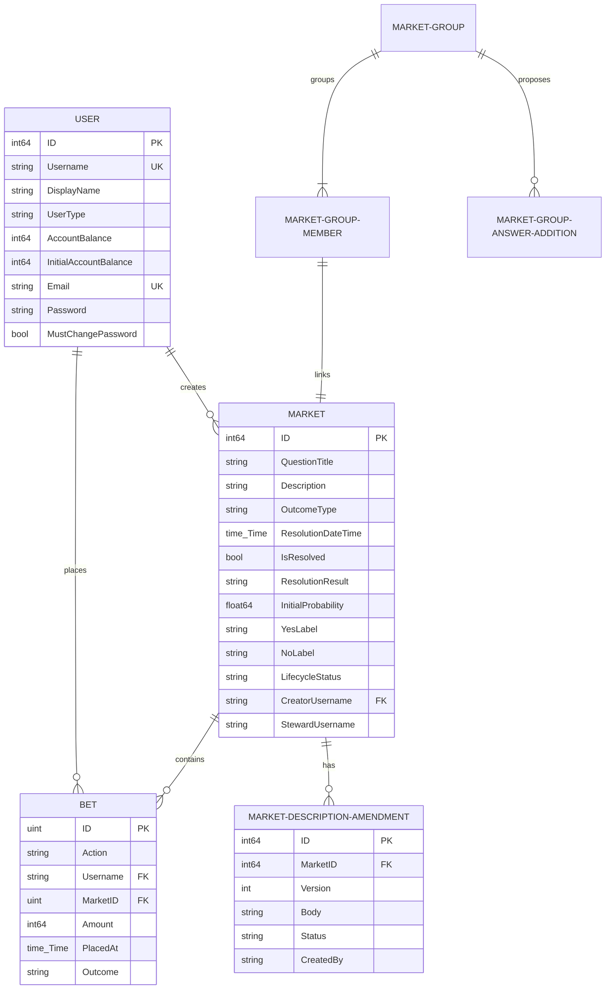
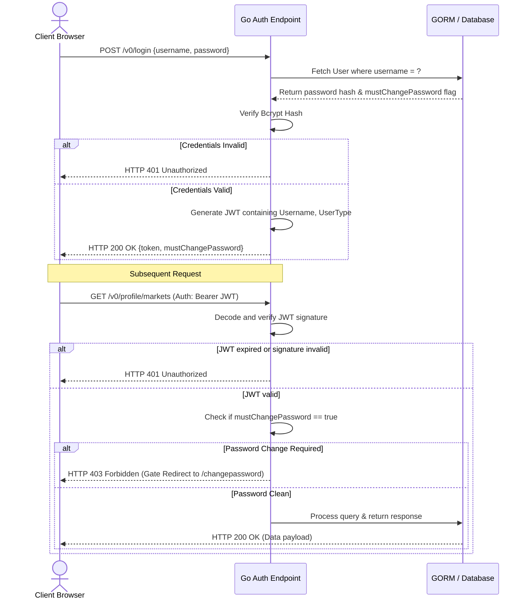
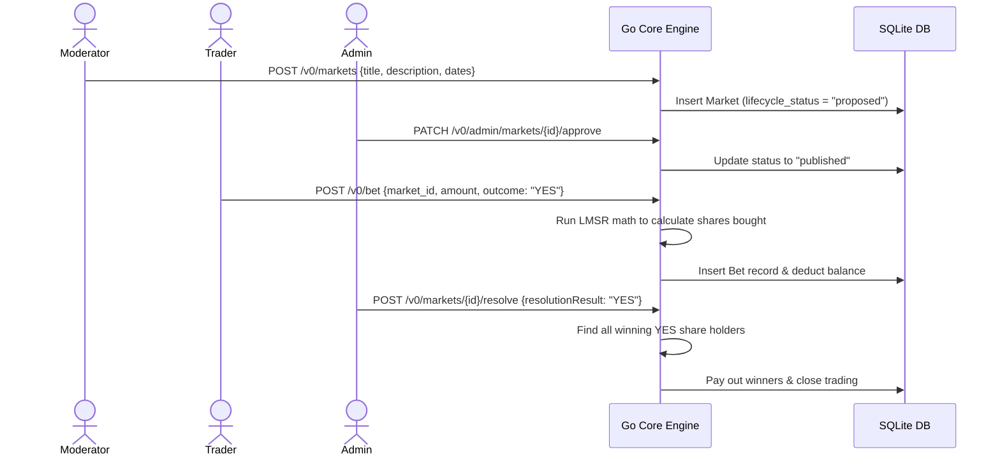

# Architecture Documentation — Prediction Market Platform Enhancement

This document provides a comprehensive technical overview of the **Prediction Market Platform Enhancement**, detailing its system design, technical architecture, database schemas, and integration flows. 

Developed and enhanced by **[Samuvel Joseph J](https://github.com/Samuvel2407)**, this platform is built on top of the open-source **[SocialPredict](https://github.com/openpredictionmarkets/socialpredict)** engine and has been modernized, debugged, and configured for SQLite-native local development.

---

## 🗺 SECTION 1 — SYSTEM OVERVIEW

### Platform Capabilities & Objectives
The **Prediction Market Platform Enhancement** is an exchange-based forecasting platform where users trade shares on the outcomes of future events. By utilizing market mechanisms, the platform aggregates public and private information to generate continuous, real-time probability estimates for events.

#### Core Objectives:
1. **Information Aggregation**: Serve as a decentralized consensus mechanism, channeling the "Wisdom of the Crowd" into accurate probability forecasts.
2. **Deterministic Liquidity**: Utilize a mathematical Automated Market Maker (AMM) to ensure that users can buy and sell contract shares at any time, regardless of market volume.
3. **Decentralized Stewardship**: Implement a tiered user model where community members propose prediction markets, moderators audit them, and administrators resolve them.

### Key User Types
- **Regular User (Trader)**: Purchases YES/NO prediction shares, manages their personal portfolio, and tracks their performance on the leaderboard.
- **Moderator**: Proposes new markets, reviews description amendments, and steward active market queues.
- **Administrator**: Creates new accounts, manages user roles, resolves markets (YES/NO), and updates site CMS settings (homepage, topic tags, discovery feeds).

### High-Level Architecture Diagram
The architecture consists of a decoupled React Single Page Application (SPA) on the frontend communicating via RESTful JSON APIs with a high-concurrency Go backend. The backend persists transaction records to a database layer via GORM, utilizing both PostgreSQL (production target) and SQLite (optimized local development).



---

## 🛠 SECTION 2 — TECH STACK

| Component | Technology | Version / Specification | Role in System |
|-----------|------------|-------------------------|----------------|
| **Frontend Frame** | React.js | `^18.x.x` | User Interface & Single Page Routing |
| **Build & Bundler**| Vite | `^5.4.11` | Optimized Asset compilation & HMR |
| **Styling** | TailwindCSS | `^3.x.x` | Modern utility-first theme framework |
| **API Client** | Native Fetch API | ES6 Standard | Client-side HTTP requests with deduplication |
| **Backend Core** | Go (Golang) | `1.22+` (with Go 1.25 toolchain fallback) | High-performance, concurrent REST API |
| **Router** | Gorilla Mux | `v1.8.1` | Pattern-matching HTTP router & subrouting |
| **ORM** | GORM | `v1.25.x` | Database schema migrations and query mapper |
| **Dev Database** | SQLite | via `glebarez/sqlite` | Zero-configuration file-based DB storage |
| **Prod Database**| PostgreSQL | standard SQL driver | Production persistence layer |
| **Security/Auth** | JWT / Bcrypt | `golang-jwt/jwt/v4` / `crypto/bcrypt` | Stateless sessions and password encryption |

---

## 📐 SECTION 3 — FRONTEND ARCHITECTURE

The frontend is structured as a component-based React application, utilizing standard React Hooks and Contexts to manage application state.

### Folder Structure
```
frontend/
├── src/
│   ├── api/            # API client modules (httpClient, marketsApi, moderationApi)
│   ├── components/     # UI components (modals, tables, charts, sidebar, headers)
│   ├── helpers/        # Context providers (AuthContent) and route declarations
│   ├── hooks/          # Custom hooks (useDocumentMeta, useMarketDetails)
│   ├── pages/          # Page views (Home, About, Markets, MarketDetails, Stats)
│   ├── utils/          # Formatting and text sanitization helpers
│   ├── App.jsx         # Entry component, Error Boundaries, and route mapping
│   └── main.jsx        # DOM mounting and provider bootstrapping
```

### State Management & Communication Layer
State is managed locally using React state hooks (`useState`, `useReducer`) combined with React Context Providers for global states (such as authentication and user configuration).

API communications are abstracted behind functional api wrappers (`src/api/*`) utilizing a unified fetch driver in `httpClient.js`. A custom **HTTP request deduplicator** is built-in to prevent redundant simultaneous `GET` fetches:



### Pages Detail
1. **Markets Page (`/markets`)**: Lists active, closed, and resolved prediction markets. Supports tag navigation filtering and infinite scroll/pagination.
2. **Stats Page (`/stats`)**: Displays system-wide volume, prediction counts, and the global leaderboard ranking top forecasters.
3. **About Page (`/about`)**: Explains prediction market dynamics, automated market maker (AMM) math, technical architecture, and developers credits.

---

## ⚙️ SECTION 4 — BACKEND ARCHITECTURE

The Go backend follows a decoupled controller-service-repository pattern, isolating HTTP transport logic from domain models and data-access code.

```
backend/
├── cmd/             # CLI entry commands (devbootstrap)
├── handlers/        # Controller layer (Translates HTTP JSON requests to Go structs)
├── internal/
│   ├── app/         # Configuration loaders, DB pools, liveness probes
│   ├── domain/      # Pure business logic (LMSR AMM equations, user validations)
│   ├── repository/  # GORM repository implementation (Postgres/SQLite data access)
│   └── service/     # Domain services coordinating repositories and rules
├── models/          # GORM DB Model schemas
└── server/          # Server configuration, middleware chains, router endpoints
```

### HTTP Request Lifecycle


---

## 🗄 SECTION 5 — DATABASE DESIGN

The schema uses GORM definitions. The platform supports soft-deletion (`gorm.Model` bindings) and utilizes versioned migrations managed directly through code.

### Database ER Diagram


### Table Schema Summary

#### 1. `users`
Persists account balances, identity strings, role flags, and credentials hashes.
- `id` (Primary Key, Auto-increment)
- `username` (Unique string, index)
- `display_name` (Unique string)
- `user_type` (`ADMIN`, `MODERATOR`, `REGULAR`)
- `account_balance` (Int64, in currency units)
- `password` (Bcrypt hash)
- `must_change_password` (Boolean)

#### 2. `markets`
Stores configuration, resolution targets, and governance metadata for prediction questions.
- `id` (Primary Key, Auto-increment)
- `question_title` (String, max 160 characters)
- `description` (Markdown body text)
- `resolution_date_time` (UTC Timestamp)
- `is_resolved` (Boolean)
- `resolution_result` (`YES` / `NO`)
- `lifecycle_status` (`proposed`, `published`, `resolved`, `rejected`)
- `creator_username` (Foreign key to users table)

#### 3. `bets`
Records every trade made on the platform. Can represent buy orders or sell orders.
- `id` (Primary Key, Auto-increment)
- `action` (`BUY` or `SELL`)
- `username` (Foreign key to users table)
- `market_id` (Foreign key to markets table)
- `amount` (Int64)
- `outcome` (`YES` or `NO`)
- `placed_at` (Timestamp)

#### 4. `market_accounting_snapshots` (Read Model)
Caches calculations to reduce database load.
- `market_id` (Unique Index)
- `last_probability` (Float64)
- `net_bet_volume` (Int64)
- `user_count` (Int)
- `bet_count` (Int)

---

## 🔐 SECTION 6 — AUTHENTICATION FLOW

The backend uses a stateless JSON Web Token (JWT) authorization workflow.



---

## 📡 SECTION 7 — API ARCHITECTURE

All business actions are prefixed under `/v0/`. The platform returns consistent payload wrappers: `{"data": ...}` on success, and `{"error": {"reason": "..."}}` on failure.

### Route Catalog

| Method | Endpoint | Authorization | Description |
|--------|----------|---------------|-------------|
| `POST` | `/v0/login` | None | Authenticates credentials and returns a JWT |
| `GET`  | `/v0/setup` | None | Returns platform configuration parameters |
| `GET`  | `/v0/markets` | None | Lists prediction markets (supports query parameters for page size and status) |
| `GET`  | `/v0/markets/{id}` | None | Fetches comprehensive details for a specific market |
| `GET`  | `/v0/content/home` | None | Retrieves CMS-managed homepage metadata |
| `POST` | `/v0/bet` | JWT | Places a trade (Buy YES/NO shares) |
| `POST` | `/v0/sell` | JWT | Sells existing prediction positions |
| `POST` | `/v0/sell/quote` | JWT | Calculates a price quote for selling a share configuration |
| `POST` | `/v0/markets` | JWT (Moderator) | Proposes a new prediction market |
| `PATCH`| `/v0/admin/markets/{id}/approve` | JWT (Admin) | Approves and publishes a proposed market |
| `PATCH`| `/v0/admin/markets/{id}/reject` | JWT (Admin) | Rejects a proposed market proposal |
| `PUT`  | `/v0/admin/content/home` | JWT (Admin) | Updates the homepage CMS configuration |

---

## 📈 SECTION 8 — MARKET WORKFLOW

Prediction markets on this platform utilize the **Logarithmic Market Scoring Rule (LMSR)** to dynamically price shares based on outstanding contracts.

### Sequence Diagram: Propose to Resolve



---

## 🏆 SECTION 9 — LEADERBOARD & REPUTATION SYSTEM

The ranking calculations are managed through the database read-model snapshot layer.

- **Durable Rankings**: Forecasters are ranked by their **Total Profits** (realized profits + potential profits of active positions).
- **Update Cycle**: Financial profiles are indexed into the `user_financial_metric_snapshots` table on demand when requesting leaderboard data or viewing public user profiles.
- **Formulas**:
  - \(\text{Equity} = \text{Account Balance} + \text{Potential Value of active shares}\)
  - \(\text{Total Profits} = \text{Equity} - \text{Initial Seed Account Balance}\)

---

## 🔧 SECTION 10 — ENGINEERING WORK COMPLETED

### Enhancements & Technical Contributions by Samuvel Joseph J

#### 1. Dev Database Portability (SQLite Integration)
- Added Go database factory (`SQLiteFactory`) supporting native file persistence without a PostgreSQL dependency or Docker container requirements.
- Allows immediate sandbox setups using `.env.dev` environment file mapping.

#### 2. Critical Bug Fixes
- **Vite API Routing Proxy Fix**: Eliminated hardcoded absolute API port targets, replacing the routing pipeline with a relative `/v0` mapping pointing to `VITE_API_PROXY_TARGET`.
- **URL Constructor Patch**: Fixed `new URL` crash in `MarketsByStatusTable.jsx` by resolving endpoints relatively through `window.location.origin` fallback checks.
- **Modal Portal Dom Patch**: Fixed `LoginModal.jsx` React portal mount failure by creating and appending `#modal-root` dynamically if absent.
- **Unscoped GORM Seed Deletes**: Prevented `UNIQUE constraint failed: homepage_contents.slug` errors on system hot-reloads.

#### 3. Modernized Theme Architecture
- Overhauled style configurations using deep dark palettes (`#020617`), bright fintech highlights, hover animations, and cleaner card spacing guidelines.

---

## 📊 SECTION 11 — PRODUCT ANALYSIS

### Strengths & Current Capabilities
- **Guaranteed Liquidity**: LMSR pricing ensures traders are never locked out of closing their positions due to missing counter-parties.
- **Clear Governance Workflow**: Separates proposal actions (moderator) from publishing decisions (admin) to ensure strict catalog control.
- **Robust Security Middleware**: Global rate-limits, secure headers, and forced password update checkpoints reduce exposure surfaces.

### System Gaps & Friction Points
- **Onboarding Friction**: New accounts start with a default zero balance, relying on administrative commands to credit trading tokens. No in-app dashboard tutorial exists.
- **Discoverability Gap**: Browsing is indexed by simple tags. It lacks algorithmic feed generation or relevance highlights.
- **Mobile Responsive Flow**: The dashboard sidebar collapses, but detailed table columns are truncated on viewport sizes below 768px.

---

## 🚀 SECTION 12 — FUTURE IMPROVEMENTS (PROPOSED)

1. **MarketMind Score (Reputation System)**: Introduce a dynamic reputation index based on personal Brier scores (historical forecast accuracy) rather than simple account balances.
2. **Prediction Journey Dashboard**: Provide user-centric performance charts showing P&L trajectories over time.
3. **Personalized Prediction Feed**: Implement a sorting algorithm ranking prediction cards by user interests and active participation indexes.
4. **Notification Engine**: Push browser alerts when stewarded markets resolve or proposed updates are approved.

---

## 🏁 SECTION 13 — DEPLOYMENT & OPERATION GUIDE

### Local Development Setup

#### 1. Run Backend Server
Ensure Go 1.22+ is configured, then run:
```bash
cd backend
# Database seeds automatically on startup (dev mode)
go run main.go
```
The server will initialize a local `socialpredict.db` SQLite database file and start listening at **http://localhost:8080**.

#### 2. Run Frontend Web App
Ensure Node.js 18+ is configured, then compile:
```bash
cd frontend
npm install
VITE_API_PROXY_TARGET=http://localhost:8080 npm run start
```
The web client starts at **http://localhost:5173**.

---

## 💼 SECTION 14 — RECRUITER SUMMARY

This project showcases the modernization, debugging, and adaptation of a Go + React prediction engine. Key deliverables successfully completed by **Samuvel Joseph J** include:

1. **Full-Stack Integration Debugging**: Identified and patched front-end rendering crashes, Vite-proxy mismatches, and database seeding exceptions.
2. **System Database Portability**: Engineered native SQLite adapter support into GORM configurations to facilitate zero-configuration local sandboxing.
3. **Responsive UI Upgrades**: Restyled theme parameters using a custom fintech palette to improve readability and dashboard aesthetics.
