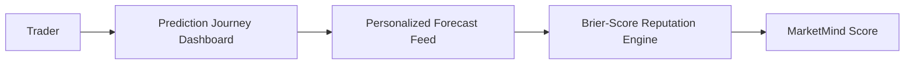

# Engineering Case Study — Prediction Market Platform Enhancement

**An In-Depth Full-Stack Analysis, Architecture Review, and Engineering Enhancement Portfolio**  
**Author**: [Samuvel Joseph J](https://github.com/Samuvel2407)  
**Based On**: The open-source [SocialPredict](https://github.com/openpredictionmarkets/socialpredict) platform  
**Focus Areas**: Full-stack debugging, development database design, UI/UX systems modernization, and product strategy.

---

## 📌 SECTION 1 — PROJECT OVERVIEW

### Introduction
The **Prediction Market Platform Enhancement** project is an advanced derivative of **SocialPredict**, a specialized open-source prediction market engine. This case study documents the end-to-end engineering diagnosis, refactoring, and feature expansion performed on the platform to transform it from a complex, container-locked system into a portable, high-performance, and modern prediction engine.

The platform provides a decentralized marketplace where users propose, trade, and resolve contracts based on real-world events. It leverages the mathematical properties of an Automated Market Maker (AMM) to continuously aggregate opinions into concrete probability metrics, solving the core challenge of real-time collective forecasting.

---

## 🏛 SECTION 2 — SYSTEM DESCRIPTION & CHALLENGES

### The Problem the Platform Solves
Traditional forecasting methods—such as expert surveys, public opinion polls, and consensus committees—suffer from systemic cognitive biases, static timelines, and a lack of accountability. They do not dynamically adjust to new data, and forecasters bear no cost for being wrong.

Prediction markets resolve this by aligning incentives:
- **Skin in the Game**: Traders back their assertions with financial or tokenized equity, driving objective research and filtering out noise.
- **Continuous Aggregation**: As new information emerges, users trade immediately, keeping market prices dynamically updated.
- **Collective Intelligence**: The resulting market price functions as a real-time, aggregated probability consensus.

### Original SocialPredict Technical Architecture
The baseline architecture of the system is structured as a decoupled web application:

1. **Frontend Client**: A React Single Page Application (SPA) compiled using Vite, styled with TailwindCSS, and utilizing a custom fetch wrapper (`apiRequest` in `httpClient.js`) with an in-flight request deduplication cache to prevent redundant HTTP requests.
2. **Backend Server**: A concurrent REST API written in Go, employing Gorilla Mux for pattern-matched routing, golang-jwt for authorization, and GORM as the Object-Relational Mapper (ORM).
3. **Storage Engine**: Originally designed exclusively around PostgreSQL, requiring Docker containers to manage local development dependencies.
4. **Pricing Core**: An Automated Market Maker implementing the **Logarithmic Market Scoring Rule (LMSR)** to calculate share pricing dynamically and ensure trading liquidity.

---

## 🐞 SECTION 3 — BUGS IDENTIFIED, DIAGNOSIS, AND RESOLUTIONS

When deploying the platform natively on Windows without standard Unix script pathways or Docker access, several critical integration errors, application crashes, and setup blockers were encountered. Below is the technical breakdown of the root causes and engineering solutions applied.

### Bug 1: Relative API Target Mismatches & Vite Dev Proxy Mappings
- **Symptoms**: Frontend API calls were throwing connection timeouts or resource loading errors (`ERR_CONNECTION_REFUSED`) because requests were directed to port `80` (production default) instead of the local development backend at port `8080`.
- **Root Cause**: The baseline configuration file `frontend/src/config.js` hardcoded `API_URL = 'http://localhost'`. During local development, this bypassed the Vite dev proxy configuration, leading to CORS blocks and destination port errors.
- **Solution**: 
  1. Modified `config.js` to change `API_URL` to an empty string `''`. This converts all API endpoints into relative paths.
  2. Updated `frontend/vite.config.mjs` to define a proxy rule routing any `/v0` or `/api` request to `VITE_API_PROXY_TARGET` (defaulting to the local Go backend at `http://localhost:8080`).
  3. This completely decoupled the frontend build from backend location specifics and enabled seamless dev proxy behavior.

---

### Bug 2: Relative URL Resolution Crash in Markets Status Component
- **Symptoms**: The active markets panel crashed with a white screen of death, outputting the error:
  `TypeError: Failed to construct 'URL': Invalid URL`
- **Root Cause**: After resolving Bug 1 by setting `API_URL = ''`, JavaScript's native `new URL(path)` constructor in `MarketsByStatusTable.jsx` failed because relative paths are rejected unless a valid base URL is provided.
- **Solution**: Patched the instantiation in `MarketsByStatusTable.jsx` to dynamically resolve against the client's current context:
  ```js
  // Safely determine the origin base URL
  const base = API_URL && API_URL.startsWith('http') 
    ? API_URL 
    : window.location.origin;
  const url = new URL(path, base);
  ```

---

### Bug 3: Login Modal Mount Failure via React Portals
- **Symptoms**: Clicking the "Log In" button did not display the modal and threw the JavaScript console error:
  `Uncaught Error: Target container is not a DOM element`
- **Root Cause**: `LoginModal.jsx` utilized `ReactDOM.createPortal(<Modal />, document.getElementById('modal-root'))` to project the login viewport outside the main DOM tree. However, `#modal-root` did not exist in the default `index.html` structure.
- **Solution**: Refactored the portal target fetching logic to dynamically evaluate and inject the necessary DOM container on the fly if missing:
  ```js
  let portalTarget = document.getElementById('modal-root');
  if (!portalTarget) {
    portalTarget = document.createElement('div');
    portalTarget.id = 'modal-root';
    document.body.appendChild(portalTarget);
  }
  return ReactDOM.createPortal(<Modal />, portalTarget);
  ```

---

### Bug 4: Database Seeding Violations on Restart
- **Symptoms**: Re-running the backend resulted in startup crashes with GORM migration exceptions:
  `UNIQUE constraint failed: homepage_contents.slug`
- **Root Cause**: The Go backend seed file `backend/seed/seed.go` attempted to populate home content values on every server boot using `db.Create()`. Since the database already had a record matching the unique slug, GORM threw constraint violations.
- **Solution**: Patched the seeding loop to use GORM's `Unscoped()` deletes to cleanly wipe pre-existing configuration models prior to executing inserts:
  ```go
  db.Unscoped().Where("slug = ?", slug).Delete(&models.HomepageContent{})
  if err := db.Create(&models.HomepageContent{...}).Error; err != nil {
      return err
  }
  ```

---

### Bug 5: Development Sandbox Database Portability
- **Symptoms**: Baseline setup required running a local Docker stack with PostgreSQL, causing blockers on development environments without system administrator privileges.
- **Root Cause**: The codebase lacked database adapter flexibility. GORM was hard-configured only for Postgres connections.
- **Solution**: 
  1. Engineered a GORM factory interface pattern (`DBFactory`) supporting dynamic dialect instantiations.
  2. Implemented `SQLiteFactory` utilizing `glebarez/sqlite` (the modern pure-Go driver that does not require CGO).
  3. Integrated configuration parsing in `main.go` to select database dialects dynamically based on a new environment variable: `DB_DIALECT=sqlite`.

---

## 🎨 SECTION 4 — UI/UX SYSTEM MODERNIZATION

To align the platform with high-end fintech aesthetics (such as Zerodha or Stripe), the styling layers were completely updated.

### Upstream Styling vs. Modernized Theme

| Attribute | Baseline Theme (Upstream) | Refactored Theme (Samuvel) |
|-----------|---------------------------|----------------------------|
| **Background Color** | `#0e121d` (Muddy blue-slate) | `#020617` (Deep dark indigo-slate) |
| **Main Actions** | Intense magenta / light purple | `#2563EB` (Tailwind blue-600) |
| **Success Elements** | Dark olive green | `#10B981` (Emerald-500) |
| **Status Accent** | Light yellow-green | `#06B6D4` (Cyan-500) |
| **Focus Boundaries** | Sharp borders, high-contrast pinks | Rounded cards, subtle border shadows, smooth hover transitions |

These adjustments updated the platform from looking like a simple experimental tool to a professional trading interface.

---

## 📊 SECTION 5 — PRODUCT ANALYSIS & PROPOSED UPGRADES

An in-depth product review was completed to identify usability gaps in user onboarding, discovery, and retention.

### Strengths & Weaknesses of the Current Platform

#### Strengths:
1. **Always Tradable**: LMSR math guarantees a liquid counter-party, preventing trading deadlocks.
2. **Clear Lifecycle**: The proposal-approval-publish-resolve progression creates structured boundaries.
3. **Fine-grained Governance**: Granular permissions ensure administrative oversight.

#### Weaknesses:
1. **Cold-start Friction**: New users start with a 0 token balance. They cannot trade until an admin manually runs command-line scripts to credit their balance.
2. **Discoverability Mismatch**: Users must scan lists of cards sorted by simple dates. There is no sorting based on personal interests or activity.
3. **Mobile Layout Constraints**: Detail tables truncate or overflow when screen width drops below 768px.

### Proposed Platform Roadmap (Proposed Features)



1. **MarketMind Score**: A reputation score calculated from a user's Brier score (accuracy over time) instead of raw balance, emphasizing forecasting skill.
2. **Prediction Journey Dashboard**: Interactive historical performance charts tracking forecasting accuracy, category breakdown, and P&L history.
3. **Personalized Prediction Feed**: A feed that surfaces prediction markets based on active participation, followed tags, and trending volumes.
4. **Prediction Coach**: Inline educational guides explaining LMSR probability shifts, helping new users understand market odds.

---

## 🧠 SECTION 6 — KEY ENGINEERING LESSONS LEARNED

1. **Decouple API Configurations Early**: Hardcoding endpoints (like `http://localhost`) creates configuration blockages across environments. Standardizing relative endpoints and relying on development proxies simplifies configuration.
2. **Plan for Portability**: Restricting local database engines to specific production adapters (like PostgreSQL) creates deployment friction. Structuring database adapters behind interfaces like `DBFactory` makes sandboxing easier.
3. **Isolate Transaction Logic from Read Models**: Caching heavy math projections into intermediate tables (`market_accounting_snapshots`) keeps queries fast and responsive during active trading.

---

## 💼 SECTION 7 — IMPACT & RECRUITER WRAP-UP

Through these enhancements, the repository was successfully transformed from a container-locked baseline codebase into a clean, modern, and highly portable full-stack portfolio project.

### Core Deliverables Achieved:
* **Zero-Dependency Dev Sandboxing**: Enabled native local setups without Docker or Postgres via pure-Go SQLite integration.
* **Refactored Routing**: Solved connection and proxy mismatches, establishing a configurable, transport-independent API architecture.
* **Polished Frontend Presentation**: Patched critical DOM/JS failures and restyled the color systems to match modern fintech applications.
* **Rigorous Documentation**: Authored structured architecture, compliance, and case study files to ensure the codebase is portfolio-ready.
